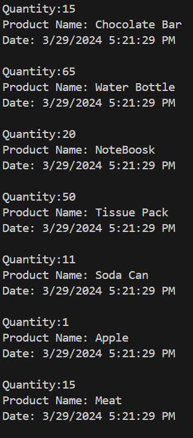

# Serialization-Deserialization-to-JSON-format-in-C-Sharp

This code demonstrates how to deserialize JSON into an object and serialize data to the JSON format in C#.

## What is Serialization and Deserialization?

Serialization is the process of converting the state of an object into a form that can be persisted or transported. The complement of serialization is deserialization, which converts a stream into an object. Together, these processes allow data to be stored and transferred.

## JavaScript Object Notation (JSON)

JSON serialization maps .NET objects to and from JavaScript Object Notation (JSON). JSON is an open standard that's commonly used to share data across the web. The JSON serializer serializes public properties by default, and can be configured to serialize private and internal members as well.

## JSON Libaray in .NET

The System.Text.Json library design emphasizes high performance and low memory allocation over an extensive feature set.

The `System.Text.Json` namespace provides functionality for serializing to and deserializing from JavaScript Object Notation (JSON).

When you exeute a progarm it will serialize collection of objects to JSON file format.


Now we want to deserialize(Read JSON file) a List of objects to objects, so we need to select file name than invoking this function:


``` File.ReadAllText(@"itemsJSON.json");```  
Then iterate over the list of objects to print all objects.



`Note:The next step is to add Deserialization JSON file to object.`